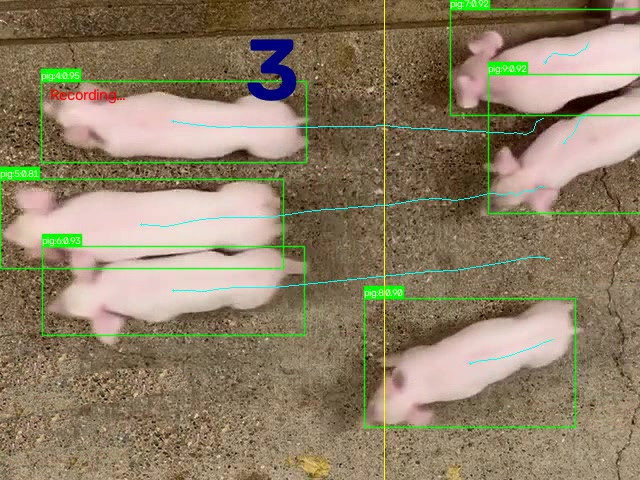

# Animal Counter

Real-time animal (pig) counting on NVIDIA Jetson Orin, using a YOLO model
exported to ONNX and compiled into a TensorRT engine, tracked with OC-SORT,
and deployed on a single-node K3s cluster via Ansible.

The system points a **fixed camera** at a counting line, tracks every pig that
crosses it, and maintains a **net bidirectional counter** (+1 right→left,
−1 left→right). It auto-records a video clip whenever a pig is detected and
stops after ~2 minutes with no detection. It is normally operated daily — powered on in the morning (counter starts at 0),
used through the day across several animal-moving iterations, and powered off
(hard power cut) in the evening — **but it can also run continuously 24/7** (the
counter then accumulates across days; reset it on demand from the web UI when
starting a new batch).

<p align="center">
  
</p>
<p align="center"><em>The app in action — YOLO/TensorRT detections, OC-SORT tracks, the yellow counting line, and the live net counter (+1 right→left, −1 left→right).</em></p>

> **Status:** counting logic validated on 30 reference videos (4/4 priority
> defect videos pass, REID-SUPPRESS regression guard confirmed). See
> [`docs/06_validation.md`](docs/06_validation.md).

---

## Table of contents

| Doc | What it covers |
|-----|----------------|
| [`docs/01_quickstart.md`](docs/01_quickstart.md) | 5-minute path from a flashed Jetson to a running app, **scripts-first** |
| [`docs/02_setup.md`](docs/02_setup.md) | Flash JetPack, first boot, system preparation |
| [`docs/03_deployment.md`](docs/03_deployment.md) | K3s + Ansible deployment (real playbooks & templates) |
| [`docs/04_configuration.md`](docs/04_configuration.md) | App configuration (`.env`, `settings.py`, parameter table) |
| [`docs/05_counting_pipeline.md`](docs/05_counting_pipeline.md) | Counting pipeline internals & anti-ID-switch guards |
| [`docs/06_validation.md`](docs/06_validation.md) | Validation workflow (`validate_on_jetson.sh`, manifest, reports) |
| [`docs/07_development_workflow.md`](docs/07_development_workflow.md) | Development workflow with `archon-jetson-dev` (CLARIFY → plan → validate → PR) |
| [`docs/08_offline_image_transfer.md`](docs/08_offline_image_transfer.md) | Transfer a Docker image from a test Jetson to an offline production Jetson via the PC |
| [`docs/11_counting_history.md`](docs/11_counting_history.md) | Persistent counting-session history (BL-68/71) — JSONL schema, compaction, disk guard (the HTTP **reader** lives in the sister repo; the shared-file contract is in `docs/IPC_CONTRACT.md`) |
| [`docs/12_jetson_network_k3s_boot.md`](docs/12_jetson_network_k3s_boot.md) | Jetson networking & K3s boot (WiFi-only, no RTC, no ethernet cable) — why + how |
| [`docs/13_rtc_install.md`](docs/13_rtc_install.md) | DS3231 RTC (HW-084) install + on-demand, durable time sync (BL-74) — the phone time push + companion live in the sister repo |
| [`docs/14_troubleshooting.md`](docs/14_troubleshooting.md) | Troubleshooting |
| [`docs/15_reset.md`](docs/15_reset.md) | Reset procedures |
| [`docs/IPC_CONTRACT.md`](docs/IPC_CONTRACT.md) | **Authoritative** shared-file contract between this repo (countingapp) and the sister repo (companion) |

> **Sister repo:** the Android phone app + the Jetson host companion (HTTP bridge) live in
> [`wloonis/animal-counter-companion`](https://github.com/wloonis/animal-counter-companion).
> They were extracted at tag `v1.1.0`. The two repos talk only via the shared files
> documented in [`docs/IPC_CONTRACT.md`](docs/IPC_CONTRACT.md): **`/files`**
> (hostPath `/data/orin/files`) for **data** (`counting-history.jsonl`, mp4 clips,
> dataset) and **`/conf`** (hostPath `/data/orin/conf`) for **config/contrôle**
> (`runtime-settings.json`, `.arret_requested` — BL-79 split).

---

## Repository layout

```
animal-counter/
├── app/                     # The counting application (container image)
│   ├── Dockerfile           # Base: dustynv/l4t-pytorch:r36.4.0 (JetPack 6.2)
│   ├── entrypoint.sh        # Modes: build-engine | serve | debug | test | validate
│   ├── requirements.txt     # pycuda, trackers==2.4.0 (OC-SORT), flask, python-dotenv
│   ├── .env / .env.example  # Runtime config (.env is gitignored; .env.example is versioned)
│   ├── model/               # my_model.{pt,onnx,engine}  (engine built by trtexec)
│   └── src/
│       ├── main.py           # Thin entry point: start()/stop() orchestration + re-exports; `if __name__: cli.main()` (BL-29)
│       ├── state.py          # Module-level singletons: shared_state, logger, _IOU_METRICS (BL-29)
│       ├── infer_thread.py   # InferThread — capture → TensorRT inference → frame_queue (BL-29)
│       ├── display_thread.py # DisplayThread — tracking → counting → recording → render (BL-29)
│       ├── validate.py       # write_result_json (validation mode, RESULT_JSON_PATH) (BL-29)
│       ├── cli.py            # argparse + signal handlers + serve/validate loop + Jetson poweroff (BL-29)
│       ├── settings.py       # Config loader (reads app/.env, defaults documented inline)
│       ├── core/
│       │   ├── inference.py   # TensorRT inference + pre/post-processing
│       │   ├── tracking.py    # OC-SORT tracker integration, letterbox undo, drawing
│       │   └── counting.py    # Counting line logic + anti-ID-switch guards
│       ├── ui/rendering.py    # Overlay & UI drawing
│       └── utils/             # frame_source, shared_state, timer_fps
├── scripts/                 # ⭐ Central automation hub (the starting point for humans)
│   ├── prepare_jetson.sh            # Discover Jetson + deploy the app (one-shot)
│   ├── training_model.sh            # Discover Jetson + build/train a model
│   ├── validate_on_jetson.sh        # Validate counting on reference videos (dev loop)
│   ├── jetson_discover.sh           # nmap scan + SSH credential test → JETSON_IP
│   ├── jetson_first_access.sh       # SSH connectivity check
│   ├── install_ansible.sh           # Install Ansible on the control machine
│   └── install_splash_screen_standalone.sh
├── ansible/                 # Ansible automation (deploy + system + model)
│   ├── inventory/jetsons.yml        # Single host, env-driven (JETSON_IP/USER/PASSWORD)
│   ├── group_vars/all.yml           # Defaults (filebrowser creds, paths…)
│   └── playbooks/
│       ├── app/   deploy_app.yml · deploy_countingapp.yml · build_countingapp.yml
│       ├── model/ build_model.yml
│       └── system/ prepare_system · install_k3s · hotspot · splash · lxde · network_ssh …
├── k3s/templates/           # Jinja2 K8s manifests (the REAL prod manifests, applied by Ansible)
│   ├── countingapp-dep.j2          # DaemonSet (the app, pausable for validation)
│   ├── countingapp-svc.j2 · countingapp-ns.j2
│   ├── countingapp-validate.j2 · countingapp-test.j2 · build-engine-batch.j2
│   ├── filebrowser-dep.j2 · filebrowser-svc.j2 · filebrowser-cmap.j2 · filebrowser-sct.j2
│   └── cronvideo-dep.j2            # Rolling video compression + cleanup
├── validation/              # Reference videos + expected-count manifest
│   ├── config.json                  # reference_video, tolerance, max_iterations, mode
│   ├── expected_counts.json         # Manifest: videos{} + disabled{}
│   └── videos/                      # validation-<seq>-#<count>.mp4 (gitignored except 1 reference)
├── docs/                    # This documentation set
└── tests/                   # pytest unit tests (counting, inference, tracking, rendering)
```

> The real manifests are the Jinja2 templates in `k3s/templates/`, rendered and
> applied by `ansible/playbooks/app/deploy_countingapp.yml`. See
> [`docs/03_deployment.md`](docs/03_deployment.md).

---

## How the app runs

The container `entrypoint.sh` takes a **mode** argument:

| Mode | What it does |
|------|--------------|
| `build-engine` | Compile `model/my_model.onnx` → `my_model.engine` via `trtexec` |
| `serve` | Run `python3 src/main.py` — on-screen X11/cv2 UI + inference/display threads (production) |
| `validate` | Run `main.py --input=FILE --file=$VALIDATE_VIDEO` and write `result.json` (used by the validation job) |
| `test` | Run `main.py` on a local test video with tracking drawn |
| `debug` | `tail -f /dev/null` — keep the container alive for `kubectl exec` |

In production the pod runs in `serve` mode. The operator controls the app via
the **on-screen X11/cv2 window** ("Counter") on the Jetson's attached display
— clickable buttons (play/pause/stop, learning, auto, reset, Arrêt) drive
**start/stop** counting, and the live net counter is drawn over the feed. There
is no web UI; the `countingapp-svc` port `31501` is declared in the manifest but
the app does not serve HTTP. Two background threads do the work:
**InferThread** (`infer_thread.py` — capture → TensorRT inference → queue) and
**DisplayThread** (`display_thread.py` — tracking → counting → recording →
render). Since BL-29, `main.py` is a thin entry point that imports them and
delegates the CLI/serve/validate loop to `cli.py` (singletons in `state.py`,
validation output in `validate.py`). See
[`docs/05_counting_pipeline.md`](docs/05_counting_pipeline.md).

---

## Operator workflow (daily, or 24/7)

1. **Power on** the Jetson in the morning → K3s starts → the `countingapp`
   DaemonSet pod boots → the web app is ready (counter = 0).
2. Open the app on the Jetson's attached screen (the on-screen X11/cv2 window),
   confirm the camera
   feed and the counting line are visible.
3. Move a series of pigs (typically 15–25) past the camera; the counter
   increments for each pig that crosses the line right→left (+1) and
   decrements for a left→right return (−1). A video clip is recorded each time
   a pig is detected and stops after ~2 minutes with no detection.
4. Repeat the series through the day — the counter accumulates across
   iterations and across recordings.
5. **Read the counter** at the end of the day, then **power off** the Jetson
   (hard cut).

For **24/7 operation**, skip the daily power-off: the Jetson and the
`countingapp` pod stay up, and the counter accumulates continuously across
days. Reset it on demand from the web UI when starting a new batch. (A pod
restart, however, resets the counter to 0 — it is not persisted across
restarts.)

---

## Onboarding for a new developer

The `scripts/` directory is the central hub. Two flows cover everything.

### ⚠️ Prepare first — do NOT run the scripts cold

Every script below assumes the environment is already prepared. Running them
without this preparation fails fast (missing credentials, no model to infer
with). Complete these **before** launching any command:

1. **Create `.env.local`** (repo root) — it holds the secrets and parameters
   the scripts + Ansible read, and it is **gitignored** (never commit real
   values). Start from the versioned example and fill in the real values:
   ```bash
   cp .env.local.example .env.local   # then edit: JETSON_USER, JETSON_PASSWORD,
                                       # WIFI_NETWORK, FILEBROWSER_ADMIN_PASSWORD,
                                       # GITHUB_TOKEN, and TRAINING_ROBOFLOW_*
   ```
   `.env.local` is consumed by `scripts/*.sh` (sourced) and by
   `ansible/inventory/jetsons.yml` + `ansible/group_vars/all.yml` (via
   `lookup('env', ...)`). Without it, discovery, SSH, and deployment all fail.

2. **Flash + prepare the Jetson** — JetPack 6.2 flashed, the device booted and
   reachable on your LAN (or its WiFi hotspot). See
   [`docs/02_setup.md`](docs/02_setup.md).

3. **Prepare a model on Roboflow FIRST** (mandatory before any deploy that
   counts) — the detection model is trained from **a dataset version the
   operator creates and versions on Roboflow**; `scripts/training_model.sh`
   fetches that version and trains YOLO → `my_model.pt` → ONNX. Without a
   versioned Roboflow dataset there is no model, and the app has nothing to
   infer. Put the Roboflow coordinates in `.env.local`:
   `TRAINING_ROBOFLOW_WORKSPACE`, `TRAINING_ROBOFLOW_PROJECT`,
   `TRAINING_ROBOFLOW_VERSION`, `TRAINING_ROBOFLOW_FORMAT`, and
   `TRAINING_ROBOFLOW_API_KEY`. Then build the model and compile the TensorRT
   engine (`build-engine` mode / `trtexec`) **on the Jetson** before `serve`.
   See [`docs/02_setup.md`](docs/02_setup.md#before-you-deploy--train--version-a-model-on-roboflow)
   and [`docs/03_deployment.md`](docs/03_deployment.md#model-build--roboflow-dataset--yolo--onnx--tensorrt-engine).

With `.env.local` in place, the Jetson reachable, and a model versioned on
Roboflow, you can run the flows below.

### A. Provision a Jetson and deploy the app
```bash
# 1. On your control machine (Ubuntu/Debian): install Ansible + helpers
sudo bash scripts/install_ansible.sh

# 2. Configure credentials (copy and edit)
cp .env.local.example .env.local   # then set JETSON_USER, JETSON_PASSWORD, WIFI_NETWORK…

# 3. One-shot: discover the Jetson on the network + deploy
bash scripts/prepare_jetson.sh
```
`prepare_jetson.sh` chains `jetson_discover.sh` (nmap scan + SSH test →
`/tmp/jetson_env.sh`) → `jetson_first_access.sh` (SSH check) →
`ansible-playbook deploy_app.yml`. See
[`docs/02_setup.md`](docs/02_setup.md) and
[`docs/03_deployment.md`](docs/03_deployment.md).

### B. Validate counting against reference videos
```bash
# Validate only the videos declared in validation/expected_counts.json (.videos)
bash scripts/validate_on_jetson.sh --full

# Or single reference video (validation/config.json -> reference_video)
bash scripts/validate_on_jetson.sh
```
This rsyncs the code + a video to the Jetson, pauses the live DaemonSet
(`nodeSelector: validate-paused=true`), runs a one-shot K8s Job
(`countingapp-validate.j2`), fetches `result.json`, compares the count against
the manifest, and writes `validation-report.json`. See
[`docs/06_validation.md`](docs/06_validation.md).

### C. Build/retrain a model
```bash
bash scripts/training_model.sh     # discover + ansible-playbook build_model.yml
```

Training reads the dataset from `TRAINING_PROJECT_DIR` (set in `.env.local`).
Two dataset sources (`TRAINING_DATASET_SOURCE`):

- **`roboflow`** (default) — the playbook downloads + unzips the Roboflow
  export (`TRAINING_ROBOFLOW_*`) into `TRAINING_PROJECT_DIR`.
- **`local`** — **no Roboflow fetch**; you train from a dataset already
  prepared at `TRAINING_PROJECT_DIR` by the one-shot script
  `scripts/prepare_local_dataset.py`. This is how you train on a dataset
  that did not come from Roboflow (e.g. a local sheep dataset).

#### Train on a local dataset (one-shot prep)

1. **Prepare** the dataset into the Ultralytics YOLO layout once (stdlib Python,
  no venv needed). The script detects `images/+labels/` subsets, auto-splits
  the train pool into train/val (deterministic), flattens test subsets, fills
  empty labels for label-less images (background samples), and writes
  `data.yaml`:
  ```bash
  python3 scripts/prepare_local_dataset.py \
    --src  /path/to/local/dataset \
    --out  dataset/sheep_template \
    --names sheep            # comma-sep class names (→ nc + names in data.yaml)
  ```
  Input labels must already be YOLO format (`class cx cy w h` normalized) —
  the same as the Roboflow `yolo26` export. (`--format coco|voc` reserved for
  future converters.)

2. **Configure** `.env.local`:
  ```ini
  TRAINING_DATASET_SOURCE=local
  TRAINING_PROJECT_DIR=/mnt/c/Dev/ai/animal-counter/dataset/sheep_template
  TRAINING_DEFAULT_COUNTING_CLASS=0   # class id to count (0 = sheep here)
  TRAINING_MODEL=yolo26s.pt
  TRAINING_EPOCHS=300
  TRAINING_IMGSZ=640
  TRAINING_DEVICE=0
  ```

3. **Train** as usual — the playbook skips the Roboflow fetch and trains from
  the prepared `data.yaml`:
  ```bash
  bash scripts/training_model.sh
  ```
  Re-running training reuses the same prepared dataset (the prep is one-shot;
  only re-run it if the source dataset changes — pass `--force` to overwrite).

---

## Requirements

| | Requirement |
|---|---|
| **Target device** | NVIDIA Jetson Orin (tested on Orin Nano 8 GB "Super") |
| **JetPack / L4T** | 6.2 / R36.4.0+ (Docker base `dustynv/l4t-pytorch:r36.4.0`) |
| **Control machine** | Ubuntu/Debian with Ansible 2.14+, `sshpass`, `nmap`, `jq` |
| **Python** | 3.10 (in the container) |
| **Camera** | USB webcam (`/dev/video0`) — fixed position |
| **Network** | Same LAN as the Jetson (or the Jetson's WiFi hotspot) |

---

## Configuration at a glance

Runtime config lives in **`app/.env`** (gitignored); copy `app/.env.example`
and adjust. Key validated values (fixed camera, 30 fps, pigs counted
right→left):

```ini
INPUT_SOURCE=CAMERA
VIDEO_PATH=/dev/video0
FPS_OUTPUT=30
OFFSET_PERCENT_COUNTING_LINE=10   # counting line at x ≈ 384 on a 640px frame
PIG_CONFIDENCE_THRESHOLD=0.6
DRAW_TRACKING=False
LOG_LEVEL=INFO
OUTPUT_VIDEO_PATH=/files
# OC-SORT anti-ID-switch tuning:
TRACKER_LOST_TRACK_BUFFER=20
TRACKER_MIN_CONSECUTIVE_FRAMES=5
COUNTING_GUARD_MAX_AGE=15
COUNTING_REID_WINDOW=15
COUNTING_LOST_BUFFER_FRAMES=60
```
Full parameter table and per-parameter rationale:
[`docs/04_configuration.md`](docs/04_configuration.md).

### Runtime features (hot-reloaded via `/conf`)

Beyond the boot-time `.env`, a second hostPath `/conf` holds
`runtime-settings.json` — **hot-reloaded in-process** at the next idle window
(BL-86), so you can tune the counter **without restarting the pod**. The
Android companion app (sister repo) writes these settings remotely:

- **Configurable counting classes (BL-78)** — count a configurable subset of
  the model's classes (multi-species); `global = sum of per-species counters`.
- **Configurable counting line (BL-83)** — orientation `vertical` |
  `horizontal` + a signed offset (percent of the frame), centered by default.
- **Configurable counting direction (BL-92)** — the +1 direction is
  configurable: `auto` (default, warm-up auto-detect of the dominant crossing
  direction per run) or `manual` (`up`/`down`/`left`/`right`, validated vs the
  line orientation). Default `auto` = the BL-83 behavior. A +1 change resets the
  counter.
- **Mask zones (BL-87)** — normalized exclusion rects; detections whose
  centroid falls inside a zone are dropped before tracking (no track → no
  count). The Android editor draws / moves / resizes / names them visually.
- **Snapshot (BL-88)** — the countingapp writes a raw-frame JPEG
  (`/files/snapshot.jpg`) ~every 5s so the companion/app can show a live
  preview + let you draw mask zones on it.
- **Overlay toggles** — `draw_tracking`, `draw_mask_zones` (independent).

Contract for the `/conf` + `/files` files shared with the companion:
[`docs/IPC_CONTRACT.md`](docs/IPC_CONTRACT.md) (kept byte-identical in both
repos).

---

## Tests

```bash
cd app && python -m pytest ../tests/ -v     # unit tests for counting/inference/tracking/rendering
```

---

## License

Copyright (C) 2026  LOONIS Wennaël

This program is free software: you can redistribute it and/or modify it
under the terms of the **GNU General Public License as published by the Free
Software Foundation, either version 3 of the License, or (at your option) any
later version**. See [`LICENSE`](LICENSE) for the full text.

This program is distributed in the hope that it will be useful, but WITHOUT
ANY WARRANTY; without even the implied warranty of MERCHANTABILITY or FITNESS
FOR A PARTICULAR PURPOSE. See the GNU General Public License for details.

## Scope

Internal project for animal-counting on a Jetson Orin. Hardware-specific
(TensorRT engine, `/dev/video0`, X11 display, K3s on a single node).